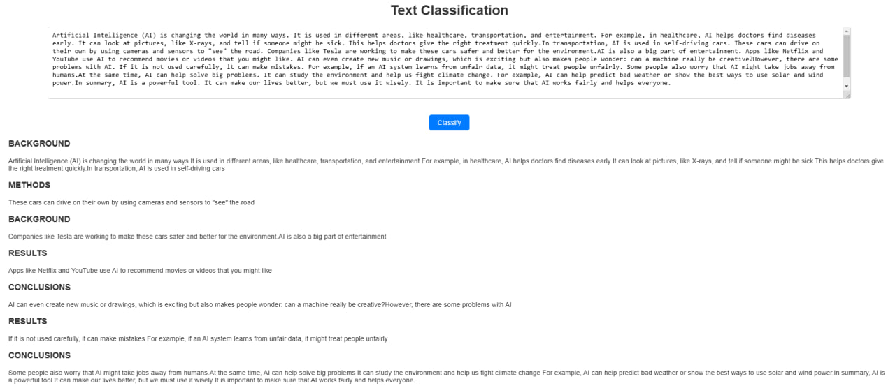

# SkimLit - NLP Project

This project aims to classify sentences into predefined categories using a combination of token-level, character-level, and positional embeddings. The workflow includes data preprocessing, model building, training, evaluation, and prediction.

## Workflow

**Data Preprocessing:**

- Load and preprocess data from the PubMed RCT dataset.
- Convert text data into token-level and character-level sequences.
- One-hot encode line numbers and total lines.

**Model Building:**

- Create token-level and character-level embedding models.
- Create models for line number and total lines features.
- Combine embeddings using `tf.keras.layers.Concatenate`.
- Build a tribrid embedding model using `tf.keras.Model`.

**Training:**

- Compile the model with `CategoricalCrossentropy` loss and `Adam` optimizer.
- Train the model on the training dataset with validation.

**Evaluation:**

- Evaluate the model on the test dataset.
- Calculate accuracy, precision, recall, and F1 score.
- Display confusion matrix and analyze misclassifications.

**Prediction:**

- Load the trained model and make predictions on new abstracts.
- Visualize predicted labels for each sentence in the abstract.

## Example of model classification

<p align="center">
    
</p>

## Files

- `char_vectorizer.pkl`: Saved character vectorizer.
- `final_model.keras`: Trained model.
- `label_encoder.pkl`: Saved label encoder.

## Run app on your local machine

1. Clone the repository:

```bash
git clone https://github.com/davydantoniuk/skimlit-nlp-project.git
```

2. Navigate to the project directory:

```bash
cd skimlit-nlp-project
```

3. Make virtual environment:

```bash
python -m venv venv
```

4. Activate virtual environment:

**Windows:**

```bash
venv\Scripts\activate
```

**macOS/Linux:**

```bash
source venv/bin/activate
```

5. Install the required packages:

```bash
pip install -r requirements.txt
```

6. Run the application:

```bash
python app/app.py
```
